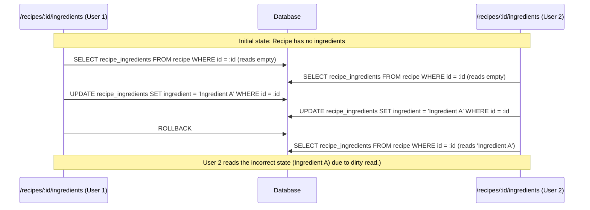
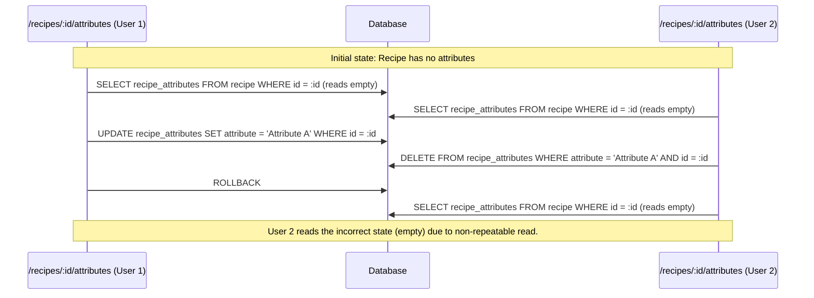
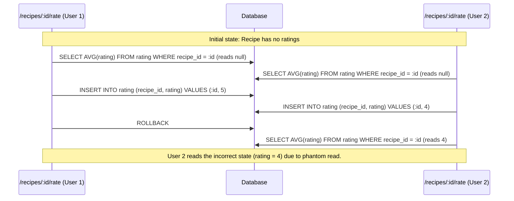

# Concurrency Control Mechanisms

### Case 1: Dirty Read Phenomenon
**Scenario**: In the `/recipes/:id/ingredients` endpoint, a user adds an ingredient to a recipe. However, 
if another user simultaneously adds the same ingredient to the same recipe, one of the transactions may 
read an outdated state of the recipe's ingredients, leading to a dirty read if the first transaction is 
rolled back.  
**Sequence Diagram**:

### Case 2: Non-Repeatable Read Phenomenon:
**Scenario**: The `/recipes/:id/attributes` endpoint adds an attribute to a recipe. If another user 
concurrently deletes the same attribute from the recipe, one of the transactions may read an 
inconsistent state of the recipe's attributes, leading to a non-repeatable read if the first 
transaction is rolled back.  
**Sequence Diagram**:

### Case 3: Phantom Read Phenomenon:
**Scenario**: The `/recipes/:id/rate` endpoint allows users to rate a recipe. If two users rate the same 
recipe concurrently, one of the transactions may read an inconsistent state of the recipe's ratings, 
leading to a phantom read if the first transaction is rolled back.  
**Sequence Diagram**:

